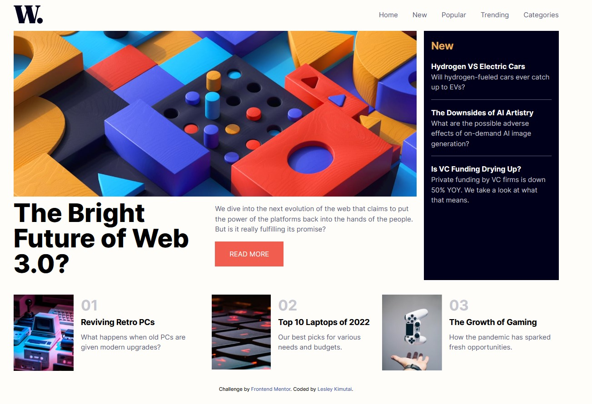
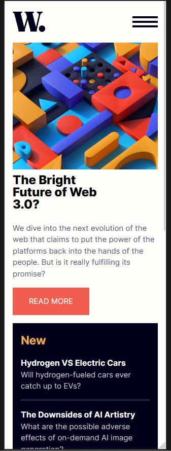

# Frontend Mentor - News homepage solution

This is a solution to the [News homepage challenge on Frontend Mentor](https://www.frontendmentor.io/challenges/news-homepage-H6SWTa1MFl). Frontend Mentor challenges help you improve your coding skills by building realistic projects. 

## Table of contents

- [Frontend Mentor - News homepage solution](#frontend-mentor---news-homepage-solution)
  - [Table of contents](#table-of-contents)
  - [Overview](#overview)
    - [The challenge](#the-challenge)
    - [Screenshot](#screenshot)
    - [Links](#links)
  - [My process](#my-process)
    - [Built with](#built-with)
    - [What I learned](#what-i-learned)
    - [Continued development](#continued-development)
  - [Author](#author)

## Overview

### The challenge

Users should be able to:

- View the optimal layout for the interface depending on their device's screen size
- See hover and focus states for all interactive elements on the page

### Screenshot

- Laptop screenshot :- 


- Mobile mockup screeenshot :-


### Links

- Solution URL: [Github Link](https://github.com/issagoodlifeInc/news-homepage.git)
- Live Site URL: [Netlify Deploy](https://your-live-site-url.com)

## My process

1. Started with writing up all the html having decided on how to best handle the layout given
   
2. Styled the page from top to bottom switching between mobile and largew screen sizes as I styled the page.

### Built with

- Semantic HTML5 markup
- CSS custom properties
- Flexbox
- CSS Grid
- Mobile-first workflow


### What I learned

Some code I'm proud of :- 

- Adding the tob and bottom border for the second news item only
```css
.news :nth-child(3) {
  border-block: 1px solid var(--darkgrayishblue);
}
```

### Continued development

Better turnaround time
Better and cleaner html markup set up
Navigation handling

## Author

- Frontend Mentor - [@leskim](https://www.frontendmentor.io/profile/leskim)


